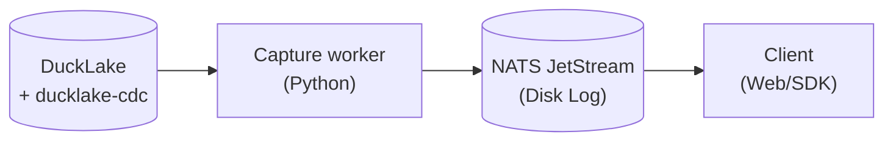

https://github.com/user-attachments/assets/d16ade5e-654a-43d4-ba09-4b3464df7230


https://github.com/user-attachments/assets/95cfe96f-b958-496d-b3a9-fdc7ab74bd5b

# ducklake-realtime

Realtime change delivery on top of [DuckLake](https://ducklake.select) and [ducklake-cdc](https://github.com/elei-io/ducklake-cdc-extension).

This project provides durable, real-time Change Data Capture (CDC) from DuckLake directly to front-end clients. It safely captures database commits, gracefully handles schema changes (DDL mixed with DML), and streams rows to a persistent event log so clients can pause, disconnect, and resume without losing data.

### Architecture & Tech Stack



* **DuckLake + ducklake-cdc:** The core database. The CDC extension provides a durable cursor over database snapshots, guaranteeing exactly what changed.
* **Capture Worker (`capture/`):** The engine that reads the DuckLake cursor and publishes changes. It is the only component that touches the database. It actively detects schema boundaries (like `ALTER TABLE`) to prevent data corruption.
* **NATS JetStream:** A lightning-fast, disk-backed event log. It completely insulates the database from traffic. Clients read from NATS, meaning 10,000 clients can stream data without making a single DuckDB query.
* **Resume Client (`resume/`):** A resilient web client that tracks its own position. If it drops offline, it reconnects to NATS and instantly fetches exactly what it missed.

---

## 🎥 Demos

The following video recordings demonstrate the core capabilities of the pipeline:

### 1. Basic Realtime Sync (DML)
Demonstrates instant synchronization of inserts and updates from DuckLake through the capture worker to the Web UI.
👉 **[Watch: 1.mp4](docs/videos/1.mp4)**

### 2. Disconnect & Catch-up (Durability)
Shows how the client UI handles connection loss. A row is inserted while the UI is disconnected (offline), and upon reconnecting, the UI instantly pulls the missed data from the NATS disk log without losing anything.
👉 **[Watch: 2.mp4](docs/videos/2.mp4)**

### 3. Start Over (Fresh Sync)
Demonstrates the "Start over" functionality. Wipes the client's local view and skips history to start listening fresh from the tip of the stream.
👉 **[Watch: 3.mp4](docs/videos/3.mp4)**

### 4. Schema Evolution
Demonstrates a mixed DDL/DML boundary. A column is dropped in DuckDB (`4.1`), and the Web UI instantly adapts to the new shape without crashing. Subsequent inserts (`4.2`) immediately flow through the new pipeline.
👉 **[Watch: Drop Column (4.1.mp4)](docs/videos/4.1.mp4)**
<br/>
👉 **[Watch: Insert after Drop (4.2.mp4)](docs/videos/4.2.mp4)**

### 5. Boundary Stop (Table Drop)
The grand finale. Dropping the tracked table triggers a permanent boundary stop. The capture worker cleanly terminates the stream, and the UI goes into a permanent "Ended" state.
👉 **[Watch: 5.mp4](docs/videos/5.mp4)**

---

## Setup

Requires `uv` and Docker.

```powershell
docker compose up -d      # Postgres (DuckLake catalog) + NATS JetStream
uv sync                   # Python environment
```

| Service | Address |
|---|---|
| Postgres | `localhost:5432` (user, password, database: `ducklake`) |
| NATS | `localhost:4222` (JetStream with file storage) |
| Web UI | `localhost:8000` |
| DuckDB UI | `localhost:4213` (via `uv run python -m tools.ui`) |

## Status

- [X] Confirm the `ducklake-cdc` extension installs and runs
- [X] Capture (Durable stream, no loss on crash)
- [X] Schema boundary (Handling `ALTER TABLE` gracefully)
- [X] Resume (Client catching up from the log)
