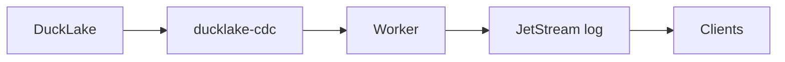

# Architecture, limits and failure cases

## The problem

DuckLake can't tell clients when data changes. Clients would have to keep querying the database, and many clients doing that at once would overload it.

We need three things:

1. **Capture**: turn every commit into an ordered stream of row changes. Never lose one, even if something crashes.
2. **Schema change**: when a table changes shape, stop the stream at the exact point, so clients never mix old and new rows.
3. **Resume**: a client that disconnects must catch up from a log on disk, without touching DuckLake.

Not covered yet: login and permissions, history for brand-new clients (they only get changes from now on), WebSockets, running on several machines.

## How it fits together

- **DuckLake**: stores the tables. Each commit is a snapshot.
- **ducklake-cdc**: remembers how far each reader got, and gives it the changes after that point.
- **Worker** (`realtime/capture/worker.py`): publishes changes to the log, and only then moves its position forward.
- **JetStream**: keeps the changes on disk so clients can replay them.
- **Client** (`realtime/resume/client.py`): reads the log only. It keeps its position and its rows in a local file. It has no database access.

## What happens when something fails

Rule: the worker moves forward **only after** the change is safely in the log. A crash can repeat a change. It can't lose one.

| Failure | Result | Tested |
|---|---|---|
| Worker crashes before publishing | Change is read again on restart | Yes |
| Worker crashes after publishing, before moving forward | Change is published twice. JetStream drops the copy if it's recent; the client ignores it otherwise | No |
| Worker killed | Its place is locked about 60 s, then free | Yes |
| Table changes while worker is off | Worker handles it on restart | Yes |
| JetStream down | Worker can't publish, so it doesn't move forward. Nothing lost | No |
| Postgres down | Worker stops. Nothing lost | No |
| Client crashes mid-update | Position and rows are saved together, so they can't disagree | Unit test |
| Client offline longer than the log is kept | Client says "too old, reload" | Code only |
| Client reconnects across a table change | Client flags that it must reload | Code only |
| Many clients reconnect at once | The log serves them, not the database | No |

Delivery can repeat, so applying the same change twice must give the same result. The client does this.

## Limits of the tools

**ducklake-cdc**
- It is early-stage software. Names and behaviour may change.
- A table change stops the reader **silently**. No error. The worker has to check for it.
- Adding, dropping or renaming a column, or changing a type, stops the reader. Renaming the table does not.
- A dropped table can't be resumed. A table recreated with the same name is a new table, and its reader must start at the snapshot that created it.
- Row events use the table's current name, not the name at commit time. We use the table id instead.
- Only one worker can read a table at a time. If it dies, another waits up to 60 s.
- Small inserts are stored inside the Postgres catalog, not as files.
- DuckLake can delete old snapshots. A reader that falls behind that point loses changes. Not tested.

**JetStream**
- **By default it never deletes anything.** The disk grows forever. We must set a limit.
- Limits are by age, size or count. The oldest messages go first.
- **The age limit is how long a client can stay offline and still catch up.** Longer means more disk.
- Duplicate protection only covers about the last 2 minutes by default.
- One server, one disk, no copies. The log is only as safe as that disk.
- Messages are limited to about 1 MB by default.
- No login or permissions.

## What is missing today

- The worker follows **one table** only.
- The client follows one table id from its config. After a drop and recreate it can't find the new id.
- "Reload" is only signalled. Nothing reloads yet.
- The log has no limit configured.
- Not measured: delay from commit to client, and a 10,000-row commit.

## What we can change

| Decision | Now | Option |
|---|---|---|
| How long the log is kept | forever | Set by age or size from environment variables. Short saves disk but forces more reloads. |
| Log subject | by table id | By name is easier to read but breaks on rename. |
| After a table change | automatic restart | Stop and ask an operator. Simpler. |
| Log technology | JetStream | Anything that keeps ordered, replayable messages. |
| Worker failure | wait for lock to expire | Run a standby worker. |
| Finding new tables | none | Worker announces new tables in the log. |

## Tools to look inside

| To see | Tool | Address |
|---|---|---|
| Tables, run SQL | DuckDB UI: `uv run --env-file .env python -m tools.ui` | http://localhost:4213 |
| Catalog and positions | Adminer | http://localhost:8081 |
| The log | NUI (connect to `nats://nats:4222`) | http://localhost:31311 |

## Perspectives (not built, worth planning)

**If the log is lost**
- The log is a buffer. DuckLake is the source of truth. To rebuild, rewind the worker's position (`cdc_consumer_reset`) and republish. This only works while DuckLake still has the old snapshots.
- A new log restarts at sequence 1, so every client's saved position is wrong. Clients must detect "log was reset" and reload. The client today only detects "my position is too old", not "my position is past the end".
- JetStream may flush to disk only every couple of minutes by default (to verify for our version). On a hard crash the last acknowledged messages could be lost, after the worker already moved forward. Options: flush on every write, or run replicated servers.

**Make the pieces independent**
- One shared event definition for worker and client, so the format is a contract.
- A small log interface (publish, read from position), so the worker and client don't depend on NATS directly.

**Make it more robust**
- Worker retries with a delay when NATS is down, instead of stopping.
- Standby worker that takes over when the lock expires.
- Check DuckLake snapshot clean-up against the worker's position, so a slow worker can't fall behind deleted history.

**Make it bigger**
- Several tables per worker, and a way for clients to find a recreated table's new id.
- A real reload for clients after a table change or a reset.
- Login and permissions per table.
- Metrics: lag between commit and log, log size, clients behind.